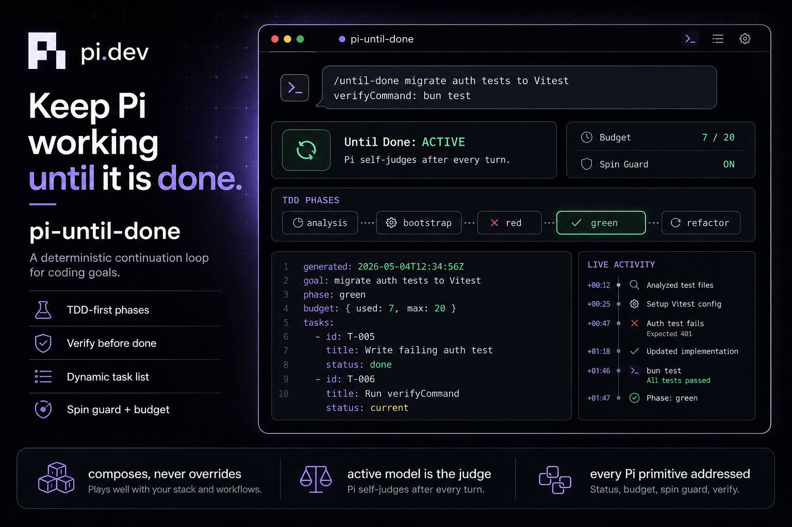

# pi-until-done



Molaison's fork of a Pi extension that brings [Hermes Agent's `/goal`](https://hermes-agent.nousresearch.com/docs/user-guide/features/goals)
("the Ralph loop with a judge") to Pi as `/until-done`. **Every
`until_done_complete` is gated by a cross-model LLM judge by default** —
the standard fix for Ralph-loop oscillation, where the executor talks
itself into a premature "done." Pick a different model than the
executor at setup time (`judgeModel: { provider, modelId }`) and the
judge LLM has to agree before the goal transitions to `done`. If you
genuinely have no second model available, opt back into same-model
self-judge with `sameModelJudge: true` — `until_done_set` refuses
without one of those two. Uses *every* Pi extension primitive that the
goal-pursuit loop needs, and coexists cleanly with every other
extension.

[](https://www.npmjs.com/package/pi-until-done)
[](https://www.npmjs.com/package/pi-until-done)
[](LICENSE)
[](https://pi.dev/packages)
[](https://github.com/srinitude/pi-until-done/actions/workflows/ci.yml?query=branch%3Amain)
[](https://github.com/srinitude/pi-until-done/actions/workflows/publish.yml)

> **Pi's own philosophy** (from
> [srinitude/pi-config](https://github.com/srinitude/pi-config)): _minimal
> core, extensible edges, deterministic, inspectable, preserve developer
> agency._ This extension hews to that line. It composes; it does not
> override. State lives in session entries. Every completion is judged
> by default — cross-model (different model than the executor) is
> required unless the contract explicitly opts into same-model
> self-judge. No system-prompt replacement, no side-database, no hidden
> state, no silent path past the judge.

### Nano Context accounting

When [Molaison's Nano Context fork](https://github.com/Molaison/nano-context) is loaded, every completed cross-model or same-model judge response with provider usage emits a `nano-context:usage` event. Nano Context persists and adds its input, output, cache-read, cache-write, and cost values to its external/cumulative totals. Calls that throw before returning a provider response emit nothing.

## Install

The upstream package is on npm; install this fork from GitHub to include Nano Context judge accounting.

### Through Pi (recommended)

```bash
pi install git:github.com/Molaison/pi-until-done          # this fork
pi install npm:pi-until-done                              # upstream, without this fork's accounting
pi install /path/to/pi-until-done                         # local install
pi -e /path/to/pi-until-done/extensions/until-done.ts     # try without installing
```

The package manifest declares the extension, skill, and preview image
(`pi.extensions`, `pi.skills`, `pi.image`), so a single `pi install`
wires up everything.

### Directly via your package manager

```bash
bun add pi-until-done           # bun
npm install pi-until-done       # npm
pnpm add pi-until-done          # pnpm
yarn add pi-until-done          # yarn
deno add npm:pi-until-done      # deno
```

The runtime entrypoint is `extensions/until-done.ts`. **No tools to
install separately** — every CI command routes through
[`mise`](https://mise.jdx.dev), which the extension assumes is already
on your PATH.

### Requirements

- Pi >= 0.x (`pi --version`)
- [Bun](https://bun.sh) >= 1.2 (the runtime extensions load through)
- [mise](https://mise.jdx.dev) on PATH (used for every CI/CD invocation)

## Use

```text
/until-done finish migrating auth tests to Vitest
```

1. Pi runs a **PHASE 0 brainstorm** — refines the goal type
   (`ticket` vs. `exploratory`), inventories accessible **surfaces**
   (logs, metrics, staging URLs, flame graphs, sandboxes), and nails
   down the verifyCommand. Sharp goals terminate cleanly; vague goals
   burn turns.
2. Pi **drafts a contract** — outcome, done-criteria, `verifyCommand`
   (auto-wrapped with `mise exec --` if not already mise-routed),
   ask-before list, decision style, goalType, surfaces, startPhase —
   and shows it to you.
3. You approve via the dialog (or `/until-done autopilot` to skip).
4. Pi calls `until_done_set` + `until_done_plan` and starts working **in
   TDD-first mode**: ANALYSIS → BOOTSTRAP → RED → GREEN → REFACTOR →
   CLEANUP (per pi-config).
5. After every turn, Pi self-judges. If done, it calls
   `until_done_complete` with quoted output of the verifyCommand as
   evidence. If blocked, `until_done_block`. Phase transitions go
   through `until_done_progress({phase})`. After complete, Pi calls
   `until_done_distill` to compile the journey into a PRD at
   `.until-done/distilled.md`.
6. When the budget (default 20 turns) is exhausted, the loop pauses and
   tells you exactly how to resume.
7. Anything you type at any point preempts the loop. For non-preempting
   side-questions, use `/until-done ask <question>`.

The status line shows the live phase glyph:
- `◷ analysis` — reading code
- `⚙ bootstrap` — validating infra
- `✗ red` — failing test exists
- `✓ green` — test passes
- `↺ refactor` — cleanup of structure
- `⌫ cleanup` — strip debug prints / scratch files before complete
- `· none` — research/doc goal

## Subcommands

| Command | Purpose |
| --- | --- |
| `/until-done <intent>` | Start setup for a new goal |
| `/until-done status` | One-line current state |
| `/until-done detail` | Full contract overlay |
| `/until-done tasks` | Print the live YAML task list |
| `/until-done plan` | Show `.until-done/tasks.yaml` location |
| `/until-done northstar` | Print the locked goal contract |
| `/until-done replan-log` | Show every replan and its reason |
| `/until-done pause` | Halt continuation, keep state |
| `/until-done resume` | Resume + reset budget |
| `/until-done cancel` | Clear the goal |
| `/until-done budget <n>` | Change turn budget (1..20000; >500 prompts a confirm) |
| `/until-done ask <question>` | Side question — does **not** preempt the loop |
| `/until-done autopilot` | Toggle skipping the contract dialog for future setups |
| `/until-done judge` | Show the session-default judge mode |
| `/until-done judge <provider>/<modelId>` | Set a cross-model judge default (recommended; e.g. `anthropic/claude-opus-4-7`) |
| `/until-done judge same` | Set same-model self-judge as the default |
| `/until-done judge clear` | Unset the judge default; future setups must specify `judgeModel` or `sameModelJudge: true` per goal |
| `/until-done help` | Show this list |

Plus: `--until-done "<intent>"` CLI flag and `Ctrl+Shift+G` shortcut
to redraw the status widget.

### Tools (8)

| Tool | Purpose |
| --- | --- |
| `until_done_set` | Lock the North Star contract after user approval |
| `until_done_plan` | Provide the TDD-first task list (called once after `set`) |
| `until_done_replan` | Mid-execution restructuring — insert/remove/replace/split/merge/reorder |
| `until_done_task_update` | Patch a single task — status, learnings, gotchas, context |
| `until_done_progress` | Record a one-line progress note + optional phase transition |
| `until_done_complete` | Declare done — requires quoted `verifyCommand` output. If the contract opted into a `judgeModel`, the executor's claim is verified by that model before the goal transitions to `done`. |
| `until_done_block` | Pause with a question for the user |
| `until_done_distill` | After complete: compile the journey into a PRD at `.until-done/distilled.md` |

### Cross-model judge (default-on, required)

Every `until_done_complete` is gated by a strict-JSON judge LLM call.
`until_done_set` requires you to pick a judge mode up front:

- **Cross-model (default, recommended):** set
  `judgeModel: { provider, modelId }` to a model **different** from
  the executor. The judge sees only the goal, done-criteria,
  verifyCommand, and the executor's cited evidence — no executor
  history to bias it. Cross-vendor pairs (Anthropic + OpenAI), or
  same-family different-size pairs (Sonnet executor / Opus judge,
  GPT-5 executor / GPT-5-mini judge), both work.
- **Same-model self-judge:** set `sameModelJudge: true` to use the
  active executor model with a fresh, completion-focused context.
  Use only when no second model is available — it's strictly weaker
  than cross-model for Ralph-loop convergence.
- **Neither set:** `until_done_set` refuses with `judge_unspecified`.
  There is no silent path past the judge.

The `/until-done judge` slash command lets the **user** pre-configure
a session-level default so the LLM doesn't have to specify on every
goal. `/until-done judge anthropic/claude-opus-4-7` configures
cross-model; `/until-done judge same` configures same-model;
`/until-done judge clear` unsets. Per-goal `until_done_set` arguments
always win over the user default.

Verdict semantics:

- Verdict `done` → executor's claim approved; status → `done`;
  judge's reason appended as evidence.
- Verdict `continue` → completion refused; judge's reason appended as
  evidence; loop stays `active` and the executor must address the gap
  with stronger evidence.
- Judge unavailable / unparseable → fail-open with a warning evidence
  line so judge-infra glitches don't block legitimate completion.

This closes the only convergence gap in the Ralph loop: a single
model evaluating its own work has a documented tendency to talk
itself into premature "done." Cross-model judge breaks that loop
because the judge has no commitment to the executor's previous
turns.

## Pi primitive coverage matrix

The brief was: *use every Pi primitive that the goal-pursuit loop
needs, and have Pi call the shots wherever the active LLM can decide
better than the extension*. Each row below maps a primitive to how
`/until-done` uses it. Lines marked **no-op** are intentionally inert
— exercising a hook for its own sake would violate Pi philosophy.
Primitives that don't serve the loop (e.g. provider registration,
editor-text mutation) are explicitly listed as "not used" below.

### Hook events (28/29 subscribed; one declarative)

| Event | Mode | Why |
| --- | --- | --- |
| `resources_discover` | declarative | Companion `skills/` and `prompts/` paths are declared via `package.json#pi.skills` and `package.json#pi.prompts` so Pi's package manager handles discovery (relative paths in a runtime hook resolve against cwd, not the extension dir, so the declarative form is the only correct path) |
| `session_start` | active | Reconstruct goal state from custom entries; honor `--until-done` flag; warn if `@qhn/pi-goal` is also installed |
| `session_before_switch` | active | Confirm before leaving an active goal |
| `session_before_fork` | active | Three-way choice: carry/leave/cancel the fork |
| `session_before_compact` | not subscribed | `SessionBeforeCompactResult` has no `customInstructions` slot — Pi reads compaction's customInstructions from outside the hook, so mutation is a no-op. Goal context is preserved via `session_compact` (re-anchor as a `CustomMessageEntry` in LLM context) and the per-turn system-prompt reminder via `before_agent_start` |
| `session_compact` | active | Re-anchor by emitting a `verdict` state event AND a `custom_message` containing recent evidence, learnings, and the current task — so the next turn's LLM context retains them past the compaction summary |
| `session_before_tree` | observed | Pi handles snapshotting; nothing to gate |
| `session_tree` | active | Full state reconstruction from new branch (todo.ts pattern) |
| `session_shutdown` | active | Clear status + widget keys cleanly |
| `context` | **no-op** | Pi philosophy: don't mutate LLM messages |
| `before_provider_request` | observed | Telemetry counter |
| `after_provider_response` | observed | Telemetry counter |
| `before_agent_start` | active | **Append** (never replace) a goal reminder block to the system prompt |
| `agent_start` | active | Reset per-iteration counters; set working-message to "pursuing: …" |
| `agent_end` | active | THE HEURISTIC JUDGE STEP: budget check, spin-guard, user-driven-turn detection, CI on stop, clean-end nudge, queue continuation. (LLM-based cross-model judge fires inside `until_done_complete`, not here.) |
| `turn_start` | active | Refresh status line |
| `turn_end` | active | Capture last assistant text snapshot |
| `message_start` | observed | Reserved hook |
| `message_update` | observed | Live status (rate-limited 500ms) |
| `message_end` | active | Capture finalized assistant text |
| `tool_execution_start` | observed | Tool-start counter |
| `tool_execution_update` | observed | Pi handles streaming UI |
| `tool_execution_end` | observed | Tool-end counter |
| `model_select` | observed | Telemetry only — judge model is whichever is active |
| `thinking_level_select` | observed | Telemetry counter |
| `tool_call` | active | **POLICY GATE**: enforce ask-before list against `bash`; tally progress signals per built-in tool |
| `tool_result` | observed | Reserved for future progress detection |
| `user_bash` | observed | Counter only — user-driven activity is allowed but doesn't count toward goal progress |
| `input` | active | Mark `userMessagedThisTurn = true` for **interactive-source** input only (extension-source `pi.sendUserMessage` calls don't flag it), so `agent_end` skips auto-continuation only when the human has actually spoken |

### Built-in tool coverage (7/7 enumerated)

| Tool | How `/until-done` reasons about it |
| --- | --- |
| `read` | weak progress signal (+1) — investigation |
| `bash` | progress signal (+2) AND policy gate against ask-before |
| `edit` | strong progress signal (+3) — real change |
| `write` | strong progress signal (+3) — real change |
| `grep` | weak progress signal (+1) — search |
| `find` | weak progress signal (+1) — search |
| `ls` | weak progress signal (+1) — search |

If `progressSignalsThisTurn === 0` at `agent_end`, `/until-done` enters
**blocked** with reason `"spin guard"` — the model literally did
nothing useful that turn.

### Other Pi primitives addressed

| Primitive | Where |
| --- | --- |
| `pi.registerCommand` | `/until-done` with subcommand autocomplete |
| `pi.registerTool` | All 8 tools: `until_done_set`, `until_done_plan`, `until_done_replan`, `until_done_task_update`, `until_done_progress`, `until_done_complete`, `until_done_block`, `until_done_distill` |
| `pi.registerFlag` | `--until-done <text>` |
| `pi.registerShortcut` | `Ctrl+Shift+G` toggles the contract widget |
| `pi.appendEntry` | Persists `until-done.state` events (load/save) |
| `pi.sendUserMessage` | Continuation prompts + setup interview |
| `pi.sendMessage` | Re-anchors goal context as a `CustomMessageEntry` after compaction (with `display:false`) |
| `pi.getCommands` | Detects `@qhn/pi-goal` collisions |
| `pi.getFlag` | Reads `--until-done` value |
| `ctx.ui.confirm/select/input/editor` | Setup confirmation, fork choice, ask-before, cancel |
| `ctx.ui.notify` | Status messages |
| `ctx.ui.setStatus` | Footer status line |
| `ctx.ui.setWidget` | Above-editor widget with full contract |
| `ctx.ui.setTitle` | Terminal title during pursuit |
| `ctx.ui.setWorkingMessage` | "pursuing: …" during streaming |
| `ctx.ui.custom` | Full contract overlay (`/until-done detail`) |
| `ctx.ui.theme.fg` | All UI color uses theme tokens |
| `ctx.sessionManager.getBranch` | State reconstruction from JSONL entries |
| `ctx.waitForIdle` | Setup flow waits for the assistant before opening confirm |
| `ctx.signal` | Threaded into CI subprocesses so user `Esc` aborts in-flight checks. Also threaded into the cross-model judge LLM call so Esc cancels in-flight verdict requests. |
| `ctx.modelRegistry` | Used by the cross-model judge to resolve the configured judge model and its auth (api key + headers). |
| `pi-ai`'s `complete()` | Used by the cross-model judge for a one-shot LLM call against the judge model — kept out of Pi's session so it doesn't pollute the executor's context. |
| Skills (`skills/until-done/SKILL.md`) | Loaded on demand to teach Pi the contract & tool protocol |
| Prompts (`prompts/`) | Reserved for future prompt templates; `/until-done` itself is an extension command (which takes precedence over template names anyway) |

> **Not used (intentional):** `pi.registerProvider`/`unregisterProvider`
> (extension does not register providers in production — judges resolve
> through the user's existing model registry; the test harness uses
> `pi.registerProvider` to wire in a faux judge for deterministic tests),
> `pi.setActiveTools` (would silently disable user tools — a
> Pi-philosophy violation), `ctx.compact`/`fork`/`navigateTree`/
> `switchSession`/`newSession` (those replace user state and must stay
> user-initiated), `pi.exec` (CI runs through its own `Bun.spawn` to
> thread `ctx.signal`), `pi.events` and `pi.setSessionName`/
> `setLabel`/`setModel`/`setThinkingLevel` (no value when Pi already
> drives those decisions), and most of the editor-mutating
> `ctx.ui.*` surface (`editor`, `setEditorText`, `pasteToEditor`,
> `setHeader`/`setFooter`, etc. — would fight the user for the
> input box). The extension intentionally leaves these on the table.

## North Star + dynamic task list

The brief was: a **fixed criterion** to guide the entire process to a
clean end, but a task list that can be edited mid-flight when reality
diverges. `/until-done` separates the two:

| | Locked at `until_done_set` | Mutable mid-execution |
| --- | --- | --- |
| `goal` | ✓ | ✗ |
| `doneCriteria` | ✓ | ✗ |
| `verifyCommand` | ✓ | ✗ |
| `askBefore` boundaries | ✓ | ✗ |
| `decisionStyle` | ✓ | ✗ |
| Task list (insert/remove/split/merge/reorder/replace) | ✗ | via `until_done_replan` |
| Per-task: validationSteps, ciCommands, styleguideRules, guardrails | ✗ | via `until_done_task_update` |
| Per-task: status, learnings, gotchas, context refs | ✗ | via `until_done_task_update` |
| `phase` | ✗ | via `until_done_progress` |
| `maxTurns` | ✗ | via `/until-done budget <n>` |

The North Star (top block) is the fixed reference point. Pi can change
*how* it gets there but never *where* it's going. The only way to
change the North Star is `/until-done cancel` followed by a new
setup — by design, this requires fresh user approval.

### Replan operations (`until_done_replan`)

| Op | Use when |
| --- | --- |
| `insert` | A new sub-task surfaced (insertAfter optional) |
| `remove` | A planned task is moot (must be `pending`/`blocked`; `done` is immutable) |
| `replace` | A pending task was specced wrong |
| `split` | One task is actually 2+ tasks |
| `merge` | Two+ tasks collapse into one |
| `reorder` | Dependencies need adjusting |

Every replan **requires a non-empty `reason`** which is appended to
affected tasks' learnings and to `/until-done replan-log`. Cycles are
rejected. The whole batch validates atomically — if one op is illegal,
none apply.

### Live YAML on disk

After `until_done_plan` and every `until_done_task_update` /
`until_done_replan`, the extension rewrites `.until-done/tasks.yaml`
in the project root so humans can read the current state without
opening the TUI:

```yaml
generated: 2026-05-04T12:34:56.000Z
goalId: ud-abc123
goal: finish migrating auth tests to Vitest
doneCriteria: bun test exits 0 with all auth specs green
verifyCommand: bun test
phase: green
askBefore: [git push]
budget: { used: 7, max: 20 }
currentTaskId: T-005
tasks:
  - id: T-001
    title: Bootstrap Vitest config
    phase: bootstrap
    status: done
    dependencies: []
    blocks: [T-002]
    prerequisites: []
    validationSteps:
      - cat vitest.config.ts
      - bun test --version
    ciCommands: [bun test]
    styleguideRules: []
    guardrails: ["no new top-level deps without confirmation"]
    learnings: ["replan: discovered tsconfig conflict"]
    gotchas: ["forgot to update tsconfig include"]
    context:
      - path: package.json
        why: read existing test script
  - ...
```

### Clean-end guarantee

When every planned task is `done` (or `skipped`) but Pi hasn't called
`until_done_complete`, the extension sends Pi exactly one structured
reminder per cycle:

> All planned tasks are marked done. Two paths from here, pick one:
> 1. Run `<verifyCommand>`. If it passes, call `until_done_complete`.
> 2. If residual work surfaced, call `until_done_replan` with reason
>    `residual_work_discovered`.
> Do not invent new work outside the plan.

After two such reminders, the loop pauses and yields to the user. The
turn budget remains the absolute backstop.

## Per-turn principle injection

Every turn, `before_agent_start` appends (never replaces) a composite
reminder block to the system prompt. Setup and the loop continuation
tick include the same blocks. Sources, in injection order:

1. **TDD discipline** — RED → GREEN → REFACTOR → CLEANUP.
2. **Verifiability discipline** — do not accept proxy signals; treat
   uncertainty as not achieved; quote command output as evidence.
3. **pi-config principles** ([extensions/lib/strings/principles/](extensions/lib/strings/principles/)):
   - Bootstrap mandate (the 8 automation-foundation items)
   - Performance mandate (any unnecessary slowdown is a defect)
   - Capability injection + test model (no internals, no shared state)
   - Definition of done (stricter — both validation suites + parity)
   - Working style (declare phase, never claim unverified)
4. **Mise-first CLI policy** — every shell command via `mise run` or
   `mise exec --`. `verifyCommand` auto-wrapped on `until_done_set`.
5. **Structural constraints** — applies to every language Pi generates
   in: ≤3 nesting depth, ≤30 LOC per construct, ≤200 LOC per file.
6. **Plan management + tool flow** — when to call `until_done_replan`,
   `until_done_task_update`, `until_done_complete`, `until_done_block`.

## TDD-first discipline (from pi-config)

`/until-done` enforces the
[pi-config](https://github.com/srinitude/pi-config) operating contract
end-to-end:

- **Phases are explicit and tracked.** Pi declares
  `phase: "analysis"|"bootstrap"|"red"|"green"|"refactor"|"none"` via
  `until_done_progress` and the extension renders it live in the status
  line.
- **No GREEN without RED.** The contract requires a failing test
  before any production change for code-shipping goals. The `SKILL.md`
  loaded in-session enforces this; the system-prompt reminder repeats
  it every turn.
- **Done = verifyCommand passes.** `until_done_complete` requires
  `evidence` that quotes the command output. Speculative completion is
  refused.
- **Performance is a defect when there's a safe gain.** REFACTOR
  encourages it.
- **No claims about unverified state.** The skill bans pretending
  tests, guarantees, or context exist when they have not been
  verified.
- **Structural constraints.** Nesting ≤ 3, construct ≤ 30 LOC,
  file ≤ 200 LOC, single responsibility per construct.

## How `/until-done` differs from `@qhn/pi-goal` and Hermes `/goal`

| | `@qhn/pi-goal` | Hermes `/goal` | `/until-done` |
| --- | --- | --- | --- |
| Setup flow | User-led interview | None — judge asks each turn | Pi-led interview |
| Judge | None — model self-decides | Auxiliary model judge call | Self-judge via tools by default; opt-in cross-model judge gates `until_done_complete` |
| State storage | Pi session entries | SessionDB.state\_meta | Pi session entries |
| Hook coverage | 1–2 events | n/a (Hermes-internal) | 28/29 events subscribed (one declarative) |
| Conflict-safe | yes | n/a | yes (auto-detects qhn/pi-goal) |
| System-prompt mutation | none | none | append-only |

If both `@qhn/pi-goal` and `pi-until-done` are installed, the user
sees a one-time notice at session\_start and can pick whichever they
prefer per session. Tool/command/event keys are namespaced
`until-done.*` and `until_done_*` to avoid collisions with anything
else in the package ecosystem.

## Edge cases the implementation handles

1. **Extension loaded mid-session** → state reconstructs from existing
   custom entries; if none, no-op.
2. **Compaction during a goal** → on `session_compact`, the extension
   emits a `CustomMessageEntry` (LLM-bound, `display:false`) containing
   the goal headline, verifyCommand, current task, recent evidence and
   recent learnings — so the next turn's LLM context retains them past
   the compaction summary. The per-turn system-prompt reminder via
   `before_agent_start` keeps the locked North Star in front of the
   model on every subsequent call.
3. **Fork during a goal** → user picks via `select` dialog.
4. **Switch session during a goal** → confirm dialog protects against
   accidental loss.
5. **Branch via `/tree`** → state fully rebuilt from new branch (matches
   the todo.ts reference pattern).
6. **User interjects mid-loop** → `input` hook flags
   `userMessagedThisTurn` (interactive-source only — extension-driven
   `pi.sendUserMessage` calls don't trigger it); `agent_end` consults
   the flag, persists a `verdict: continue` state event with reason
   `"user-driven turn"`, and skips auto-continuation. Flag resets in
   `agent_end` after consumption (not in `agent_start`, which would
   race with the input hook).
7. **Model produces no tools/text** → `progressSignalsThisTurn === 0`
   triggers `blocked` with spin-guard reason, prevents tight loop.
8. **Turn budget exhausted** → auto-pause with explicit `/until-done
   resume` instructions (Hermes parity).
9. **Pi calls `until_done_complete` falsely** → user can `/until-done
   resume` to challenge it; new evidence required.
10. **Goal already exists during setup** → `select` dialog: replace /
    keep / cancel.
11. **RPC / print mode (no UI)** → `ctx.hasUI` checks degrade
    gracefully; `setWidget` skipped, `notify` still fires, custom
    overlay falls back to JSON dump.
12. **Provider/model switch mid-goal** → no judge re-binding required
    because the active model itself is the judge.
13. **Thinking level change mid-goal** → tracked but doesn't affect
    state.
14. **Compaction over contract** → contract is one of the first entries
    on the branch; reconstruction walks from root.
15. **Goal text with special chars** → rendered through theme tokens,
    no shell expansion.
16. **`--until-done` flag at startup** → triggers `/until-done <text>`
    via `sendUserMessage` exactly once at startup.
17. **`@qhn/pi-goal` also installed** → coexistence notice; commands do
    not collide because `/goal` and `/until-done` are different names.
18. **Ask-before timeout (no human at terminal)** → 30s timeout on
    `confirm`; on dismiss, the tool call is blocked with `user denied`.
19. **Hard ceiling 20000 turns** → `cmdBudget` rejects values >20000;
    values >500 prompt a confirm dialog (the "go to lunch" threshold)
    so users opt into the spend / wall-clock cost explicitly.
20. **Goal cancelled mid-streaming** → state transitions to `cleared`;
    next `agent_end` short-circuits via `state.status !== "active"`
    guard.
21. **Approval dialog times out** → `confirm` resolves to false; goal
    is cleared.
22. **Multiple goals attempted** → `until_done_set` rejects with
    `goal_exists`.
23. **Tool called before approval** → `until_done_set` rejects with
    `not_confirmed`.
24. **Skill discovery** → declared via `package.json#pi.skills` and
    `pi.prompts` so Pi's package manager resolves paths against the
    extension root, not the user's cwd.
25. **Session shutdown** → status + widget keys cleared; entries
    persist on disk for the next `pi -c`.

## Verifying

Every CI/CD operation runs through `mise`. Once you've installed deps:

```bash
cd pi-until-done
mise install              # installs bun + node per mise.toml
mise run install-deps     # installs bun deps (idempotent)
mise run check            # fast: typecheck + lint + format (parallel)
mise run ci               # full: typecheck + lint + format + compile + test + build
mise run release-ready    # release-readiness suite (parity check + surface presence)
```

Then in a Pi project:

```bash
pi -e ./extensions/until-done.ts
/until-done finish migrating auth tests to Vitest
```

## Security

`/until-done` is an autonomous-loop extension. By default it runs Pi's
built-in tools (`read`, `bash`, `edit`, `write`, `grep`, `find`, `ls`)
on the active model's behalf each turn. You should know:

- **Filesystem writes** are unrestricted unless you list specific commands
  in the contract's `askBefore[]`. Ask-before triggers a confirm dialog
  for any matching `bash` invocation. Examples: `git push`,
  `destructive sql`, `rm`, `terraform apply`.
- **Network calls** are whatever the model decides to make via `bash`.
  The extension itself makes no network calls.
- **Credentials** are never read or stored by the extension. Pi's session
  state is the only thing it persists, and it lives in your local Pi
  session entries (JSONL).
- **CI commands** run through `mise exec --` against your project's mise
  config. `mise tasks ls --json` is the only direct invocation the
  extension makes for discovery; nothing else.
- **No system-prompt replacement** — the extension only *appends* to the
  system prompt via `before_agent_start`, so other extensions' rules
  still apply.
- **No background side effects** — no daemons, no hidden state, no
  uploads, no telemetry. State is auditable in the JSONL session log.
- **Hard turn budget** ceiling of 20000 with a confirm dialog above 500;
  default is 20. Spin guard, clean-end nudge, CI failure, user input,
  and `/until-done pause` all preempt regardless of budget.

For vulnerability disclosure see [SECURITY.md](SECURITY.md).

## Cross-platform CI

The GitHub workflow runs the full suite on **macos-latest**,
**ubuntu-latest**, and **windows-latest** in parallel via a matrix
strategy. The release-readiness job runs the same matrix on `main` and
on dispatch.

### Upstream Pi watcher (auto-merge gated on CI + CodeRabbit)

Two workflows cooperate to keep this extension current with upstream
pi-mono with no manual ceremony when the upgrade is clean — and
**zero auto-merges when it's not**:

1. **`.github/workflows/upstream-watch.yml`** (daily 06:13 UTC + manual
   dispatch) — checks npm for new releases of
   `@earendil-works/pi-coding-agent` and `@earendil-works/pi-ai`, refreshes
   `bun.lock` if a bump is available, runs `mise run ci` against the
   bumped versions in-workflow, and opens / updates a PR
   (`upstream/pi-bump`) with `coderabbitai` requested as reviewer and
   the `auto-merge` label.
2. **`.github/workflows/upstream-pi-merge-gate.yml`** — fires on every
   PR review submission and every CI workflow completion. It evaluates
   the PR's latest head SHA against **two explicit gates**:
   - **CI is green** — every required check run on the head SHA
     reports `success` (or `skipped`), and at least three checks have
     completed (the OS matrix). This excludes the gate's own runs to
     avoid deadlocking on itself.
   - **CodeRabbit approved** — the most recent review from
     `coderabbitai[bot]` is `APPROVED`.

   Only when **both** gates are green on the same SHA does the workflow
   call `gh pr merge --squash --delete-branch`. Either gate failing
   keeps the PR open. The gate re-evaluates on every push, every CI
   completion, and every review submission, so push-fixes converge
   automatically.

This is an **explicit gate in workflow source**, not GitHub's native
auto-merge. Branch protection settings are unnecessary for the gate to
work, though they remain a useful defense-in-depth.

Repo prerequisites:

1. **`UPSTREAM_PAT` repo secret** — a personal access token with
   `repo` + `workflow` scope. Without it, PRs created by
   `upstream-watch.yml` use `GITHUB_TOKEN` and **no downstream
   workflows fire on the PR** (GitHub's recursive-workflow safeguard).
   The merge gate would then never see CI results and would never
   merge. The workflows fall back to `GITHUB_TOKEN` when the secret is
   absent, so the PR opens but holds indefinitely until CI is
   re-triggered manually.
2. **CodeRabbit installed** on the repo (<https://app.coderabbit.ai>).
   The workflow's `reviewers: coderabbitai` request invites it
   explicitly; CodeRabbit posts an approving review when its analysis
   is clean.

When upstream introduces a real API break, the in-workflow CI fails,
the PR-triggered CI matrix fails, the merge gate refuses to merge —
fix the extension code drift before merging rather than pinning back.

Tests live in [`tests/`](tests/) and run against a **real Pi runtime**
(via `createAgentSessionRuntime` from `@earendil-works/pi-coding-agent`)
with deterministic LLM responses supplied by `registerFauxProvider`
from `@earendil-works/pi-ai/compat`. No hand-rolled `ExtensionAPI` mocks. Real
fs (temp dirs), real subprocesses (`Bun.spawn`), real `AbortSignal`
abort propagation. The harness lives in
[`tests/helpers/`](tests/helpers/).

| Path | Covers |
| --- | --- |
| `tests/integration/harness-smoke.test.ts` | Runtime boots; extension binds; tools and command register |
| `tests/integration/goal-flow.test.ts` | Full happy-path E2E: setup → set → plan → progress → task_update → complete → distill, with real `tasks.yaml` + `distilled.md` on disk |
| `tests/tools/lifecycle.test.ts` | `until_done_set/complete/block/progress` status guards + state transitions |
| `tests/tools/judge.test.ts` | Cross-model judge: schema round-trip, judge-approves, judge-rejects, malformed JSON fail-open |
| `tests/tools/plan.test.ts` | `until_done_plan` dependency validation, `tasks.yaml` write |
| `tests/tools/replan.test.ts` | `until_done_replan` cycle detection, done-immutability, replanLog growth |
| `tests/tools/task-update-distill.test.ts` | Task patches, cursor advancement, `distilled.md` write |
| `tests/commands/router.test.ts` | Subcommand dispatch — autopilot toggle, "status report on the migration" → setup, budget numeric vs. text disambiguation |
| `tests/commands/setup.test.ts` | Contract dialog approve/reject, autopilot skips dialog, replace-vs-keep selector |
| `tests/commands/control.test.ts` | Pause/resume/cancel/budget — including resume-from-done with confirm and cleanEndPrompts reset |
| `tests/commands/info-ask.test.ts` | Status / detail / tasks / northstar / replan-log / ask side-question |
| `tests/hooks/agent-hooks.test.ts` | `agent_start`/`agent_end` — `userMessagedThisTurn` race fix (#1), budget exhaustion path |
| `tests/hooks/before-agent-start.test.ts` | System-prompt reminder block — augments only when active, includes verifyCommand line |
| `tests/hooks/session-hooks.test.ts` | `session_start` reconstruction, `session_compact` re-anchor (`CustomMessageEntry`), `session_shutdown` cleanup |
| `tests/hooks/tools-hook.test.ts` | Ask-before — UI-on confirm, no-UI block, scoring, `until_done_*` exclusion (#20) |
| `tests/ci/discovery.test.ts` | `discoverChecks` with real fs scenarios — Java vs Kotlin Gradle, PYTHON vs PYTHON_UV, ROBLOX vs LUAU, content-sniff disambiguation |
| `tests/ci/runner.test.ts` | `runOne` against real subprocesses — `true`/`false`/timeout/AbortSignal abort/output truncation marker |
| `tests/mise.test.ts` | `routeThroughMise` / `isMiseCommand` semantics |
| `tests/profiles/{bun,pnpm,npm,yarn,deno}.test.ts` | Each TypeScript runtime profile shape |
| `tests/platform/os.test.ts` | macOS/Linux/Windows path + line-ending neutrality |
| `tests/platform/discovery.test.ts` | All profiles use POSIX-style markers; mise as sole entry point |
| `tests/build-smoke.ts` | The runtime entrypoint resolves on every supported OS |

Run them with `mise run test`. The full suite (`mise run ci`) covers
typecheck + lint + format + compile + test + build and finishes in
under 5 seconds locally.

## Contributing

This project is open source under MIT. Contributions welcome.

- Read [AGENTS.md](AGENTS.md) — the project's pi-config-derived contract
- Read [CONTRIBUTING.md](CONTRIBUTING.md) — dev setup, TDD flow, PR rules
- **No AI co-authorship trailers** in commits or PRs (project policy
  enshrined in [CONTRIBUTING.md](CONTRIBUTING.md#no-ai-co-authorship-in-commits-or-prs))
- See [CODE_OF_CONDUCT.md](CODE_OF_CONDUCT.md) for community standards
- For security issues: [SECURITY.md](SECURITY.md) (do not file public issues)
- Changelog: [CHANGELOG.md](CHANGELOG.md)

PR template at [.github/PULL_REQUEST_TEMPLATE.md](.github/PULL_REQUEST_TEMPLATE.md).
Issue templates under [.github/ISSUE_TEMPLATE/](.github/ISSUE_TEMPLATE/).

## Sources

- Hermes Agent goals doc: https://hermes-agent.nousresearch.com/docs/user-guide/features/goals
- Hermes Agent goals source: `hermes_cli/goals.py` in
  https://github.com/nousresearch/hermes-agent
- Pi extension API: `packages/coding-agent/src/core/extensions/types.ts`
  in https://github.com/badlogic/pi-mono
- Pi philosophy: https://github.com/srinitude/pi-config
- Pi extensions doc: https://pi.dev/docs/latest/extensions

License: MIT.
